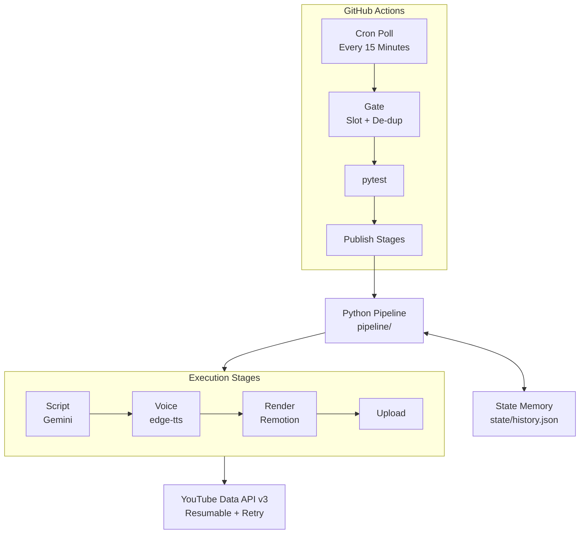
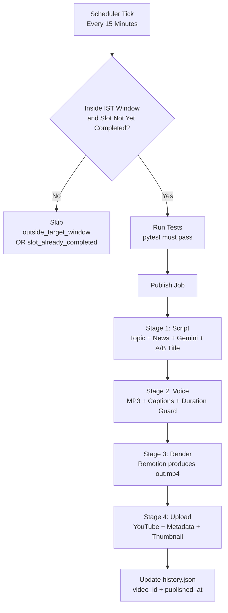
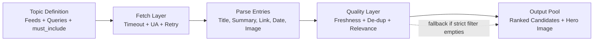
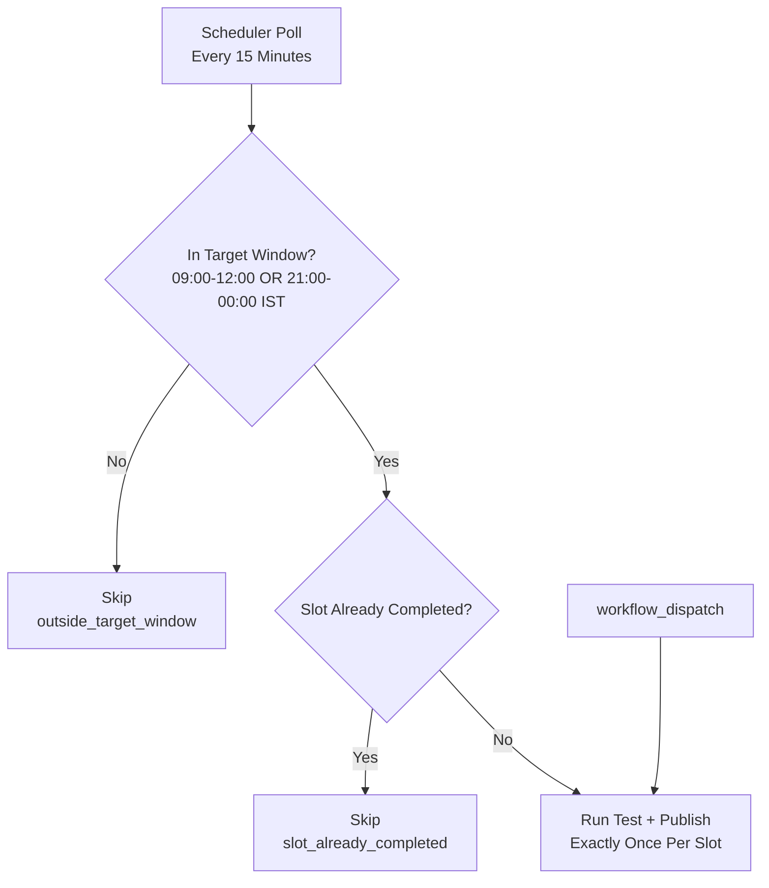
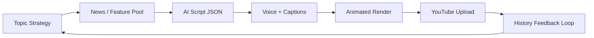

# YouTube AI Shorts Platform

## Leadership Architecture Brief

Audience: Senior Management, Enterprise Architect, Development Manager
Date: 2026-06-28
Companion docs: `README.md` (engineering reference) · `BUILD_PROMPT.md` (rebuild instruction set) · `CLAUDE.md` (contributor guide)

---

## 1) Executive Snapshot

### What this platform does
A fully automated content factory that researches, scripts, narrates, renders, and publishes vertical YouTube Shorts **twice daily**, with no human in the loop.

### Why this matters
- Predictable publishing cadence with minimal human dependency
- Effectively **$0/month** operating cost through free/open tooling
- Faster time-to-market from idea to published Short
- Repeatable and auditable process via CI workflow controls

### Business outcome
- Two publish slots per day: **09:00 IST** and **21:00 IST**
- Automated slot de-duplication to prevent accidental double publishing
- End-to-end flow from topic selection to YouTube upload, fully unattended
- Single durable state file (`state/history.json`) — no database, no server to operate

---

## 2) Architecture at a Glance

Three decoupled layers communicate only through typed JSON artifacts. The content/“brain” layer never calls the animation layer directly — the sole bridge is one validated data file.



The typed handoff between Python and Remotion is **`build/render-props.json`**, validated by a zod schema on the renderer side before any frame is drawn.

---

## 3) End-to-End Operational Flow



Exit codes returned by the orchestrator: **0** success · **2** configuration error · **1** any other failure. CI maps these to job status, and any failure triggers a best-effort alert (Slack and/or auto-opened GitHub issue) that never masks the original error.

---

## 4) Topic Selection Design

### Topic catalog
- ai_news (accent #6C5CE7, grid pattern)
- copilot (accent #00B894, dots pattern)
- claude (accent #E17055, rings pattern)
- cursor (accent #0984E3, diagonal pattern)

### Selection modes
1. **rotate** (default)
- Deterministic daily selection by date ordinal (`date.toordinal() % 4`)
- Guarantees balanced coverage across the topic set, zero extra network calls

2. **trending** (optional)
- Computes a per-topic score from fresh item counts
- Applies a cooldown penalty to recently used topics
- Can incorporate analytics weights from historical performance

### Why this is architecturally sound
- Deterministic baseline avoids topic starvation
- Trending mode enables adaptive behavior when needed
- Cooldown prevents a repetitive viewer experience

---

## 5) Feature/News Fetching and Relevance Pipeline



Resilience controls:
- Feed-level failures are isolated — a single source outage never fails the pipeline
- A typed `NewsFetchError` is raised only if the entire candidate pool is unusable

---

## 6) Script Generation: Framework and AI

### AI stack used
- SDK: `google-genai` (the current, supported SDK — not the deprecated `google-generativeai`)
- Model: `gemini-2.5-flash` with an automatic fallback chain (`2.5-flash` → `2.5-flash-lite` → `2.0-flash` → `flash-latest`)

### Prompt construction inputs
- Selected topic focus
- Fresh source items (title/summary/link/date)
- Anti-repetition memory from recent history
- Rotating hook-style guidance (variety across runs)
- Audience clarity constraints; output language is configurable (`LANGUAGE`, default English)

### Structured output contract
The model must return strict JSON containing: `title`, `title_variants` (for A/B), `description`, `tags`, `lines` (spoken script), `points` (visual cards), and `flow` (animated process steps).

### Why this design works
- Structured output minimizes post-processing ambiguity
- Tolerant extraction + strict validation protect downstream stages
- The output format is directly consumable by the rendering system
- A free-quota failure produces an actionable “use a personal account key” message

---

## 7) Voice Rendering and Audio Intelligence

### Technology
- `edge-tts` for synthesis (free)
- `mutagen` for reliable MP3 duration measurement

### Outputs
- `build/voice.mp3`
- `build/captions.json` (duration + any word boundaries)

### Controls
- Retry for transient synthesis issues
- Empty-audio rejection
- **Minimum-duration guard:** the run aborts before render/upload if audio is implausibly short

### Voice profile
- Default voice: **`en-US-JennyNeural`** (energetic, clear delivery; rate +16%, pitch +8Hz, volume +14%)
- Fully configurable via `TTS_VOICE`/`TTS_RATE`/`TTS_PITCH`/`TTS_VOLUME`, and overridable **per topic** in `topics.py`
- For an Indian voice, set e.g. `TTS_VOICE=en-IN-PrabhatNeural` (male) or add a per-topic `voice`

> Architectural note: audio duration is taken from the file itself via `mutagen`, never from the speech engine’s word-timing events (which edge-tts frequently omits). This single rule prevents the “one-second video” failure mode.

---

## 8) Video Composition, Animation, and Rendering

### Rendering framework
- Remotion 4 (React + TypeScript)

### Composition profile
- 1080 x 1920 (vertical), 30 FPS
- Total duration derived from the measured audio length

### Animation/visual components
- Dynamic gradient background with topic-driven accents and per-topic pattern
- Topic chip and animated hook (title) opening
- Highlight card sequence
- Optional flow-diagram scene (boxes and arrows)
- Always-on subtitles (driven by `lines`, not word-timings) and a progress bar
- Optional faint hero image overlay (a broken URL can never fail the render)

### Data contract between Python and Remotion
- `build/render-props.json` is the single typed handoff artifact
- A zod schema validates props before render; new fields require updating both producer and consumer

### Performance profile (free-runner optimized)
- Tuned codec settings (h264 + veryfast preset, CRF 24)
- Codec-safe scaling policy (avoids fractional pixel dimensions)
- Concurrency controls for CI runtime balance; all knobs overridable via `REMOTION_*`

---

## 9) YouTube Upload and Publishing

### Upload mechanism
- YouTube Data API v3 with an OAuth refresh token
- Resumable upload with retry/backoff on transient HTTP/transport errors

### Metadata operations
- Title, description, tags from the generated script; category = Science & Technology
- Marked not-made-for-kids
- Privacy controlled by environment (`YT_PRIVACY`); `REVIEW_BEFORE_PUBLISH=true` forces private upload for manual approval
- Best-effort custom thumbnail assignment (requires a verified channel)

### Completion state
- `video_id` and publish timestamp persisted to `history.json`
- History committed back to git for auditability and anti-repetition memory

---

## 10) Twice-Daily Automation with GitHub Actions



Why this pattern instead of exact-time cron:
- Handles scheduler drift gracefully
- Preserves exactly-once behavior per slot
- Reduces operational misses for a business-critical cadence

To change run times: edit the `hour=9` / `hour=21` values in the gate’s Python block (keeping the UTC+5:30 conversion) and/or the poll cron.

---

## 11) Capability Map (Enterprise View)

| Capability | Implementation | Outcome |
|---|---|---|
| Scheduling and orchestration | GitHub Actions workflow + gate | Deterministic twice-daily execution |
| Content intelligence | topic_select + fetch_news + generate_script | Fresh and relevant scripts |
| AI generation | Gemini via google-genai (fallback chain) | Structured script assets |
| Voice synthesis | edge-tts + mutagen duration | Natural narration + reliable length |
| Visual generation | Remotion templates and animations | Branded, modern short-form video |
| Distribution | YouTube API v3 resumable upload | Reliable publishing with metadata |
| Governance and memory | history.json committed to git | Auditability and anti-repetition |
| Observability | typed exit codes + alerts + healthcheck | Fast failure diagnosis, early warning |

---

## 12) Repository Structure (Implementation Detail)

```text
.github/workflows/
  daily-short.yml            # poll + gate + test + publish stages + commit history
  healthcheck.yml            # weekly credential checks (Mon 04:00 UTC)

pipeline/
  run.py                     # stage orchestrator + exit-code mapping
  config.py                  # central config + atomic JSON writer
  topics.py                  # topic definitions, feeds, keywords, visual theme hints
  topic_select.py            # rotate/trending strategy + cooldown
  fetch_news.py              # ingestion and relevance filtering
  generate_script.py         # Gemini prompt + strict JSON handling + fallback chain
  tts.py                     # voice synthesis + caption timing
  render_props.py            # typed render payload builder + A/B title picker
  thumbnail.py               # best-effort branded thumbnail (Pillow)
  upload_youtube.py          # resumable upload to YouTube
  history.py                 # durable, corruption-tolerant state memory
  analytics.py               # optional feedback loop from public stats
  preflight.py / errors.py / notify.py / healthcheck.py / logging_setup.py

remotion/
  src/Root.tsx               # composition config + duration-from-audio
  src/Short.tsx              # animation scenes + zod schema (the contract)
```

---

## 13) Risk and Mitigation Summary

| Risk | Potential Impact | Mitigation in Current Design |
|---|---|---|
| External source downtime | Weak content pool | Multi-source ingestion + Google News fallback |
| LLM throttling or model issues | Script generation failure | Model fallback chain + retries + actionable errors |
| TTS failures / short audio | Missing or low-quality narration | Retry + output validation + minimum-duration guard |
| Render instability | Delayed publish | Tuned render profile + codec-safe scaling + output verification |
| Duplicate publishing | Channel quality risk | Slot de-dup gate logic |
| Credential expiry | Pipeline interruption | Preflight checks + weekly healthcheck (token refresh + Gemini call) |
| Silent partial writes | Corrupt artifacts | Atomic file writes everywhere |

---

## 14) Leadership Takeaways

For Senior Management:
- A productionized, low-touch content engine with predictable throughput, near-zero operating cost, and an early-warning health check on credentials.

For Enterprise Architecture:
- Clean stage boundaries, a single typed handoff artifact, resilient integration patterns (timeouts, retries, fallbacks), and auditable state transitions committed to version control.

For Development Management:
- Stage isolation in CI improves observability, debugging speed, and team ownership boundaries; pure logic is unit-tested (15 suites) and gates every release.

---

## 15) Visual Flow Summary (Presentation Slide Style)



This architecture is implementable, scalable for additional channels/topics, and operationally robust for unattended twice-daily publishing.

---

## 16) Honest Scope Note

This system produces and publishes videos automatically. It **cannot** automate monetization — that requires meeting YouTube Partner Program thresholds, which no tooling can bypass. Platforms also demote repetitive, mass-produced AI content, which is why the design invests in genuine variety (anti-repetition memory, rotating hooks, fresh real news).
