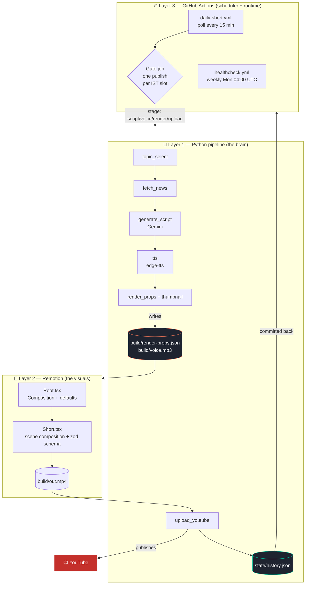
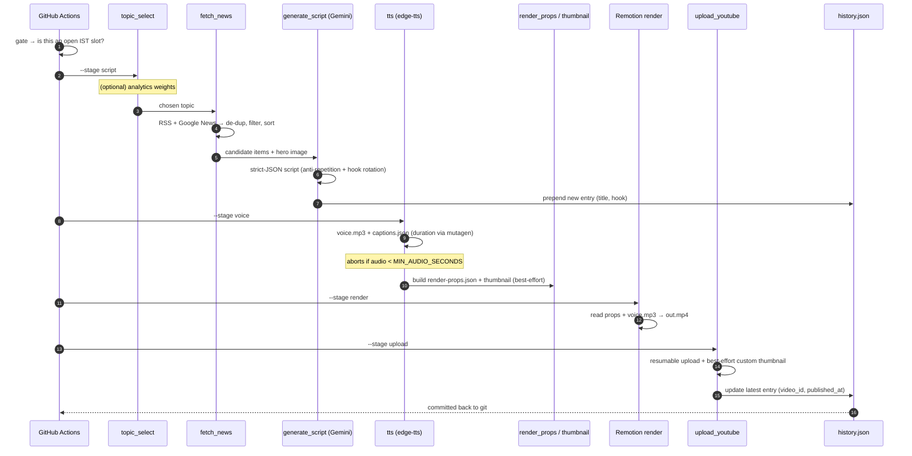
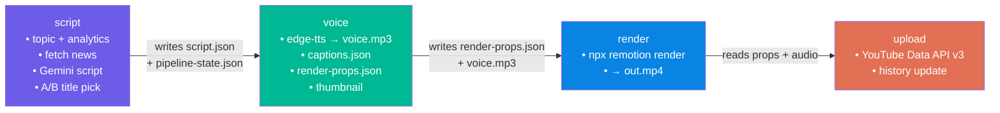
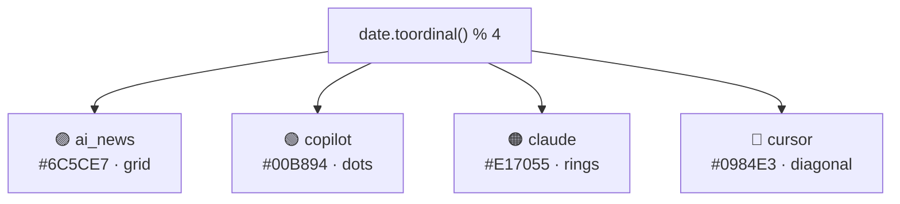
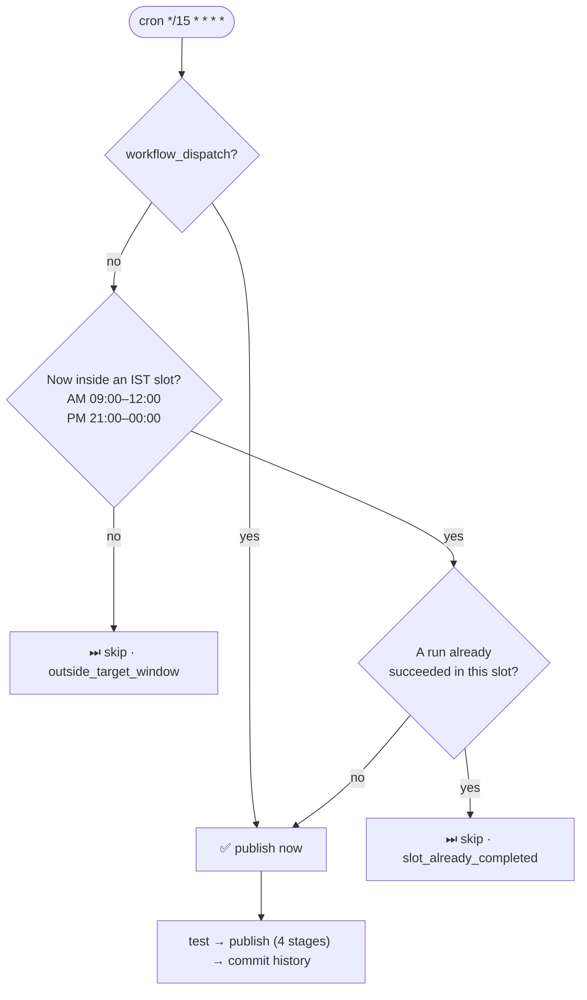

<div align="center">

# 🎬 YT AI Shorts — Autonomous YouTube Shorts Factory

**A zero-cost, fully-automatic pipeline that researches, scripts, narrates, renders, and publishes a vertical AI-news Short to YouTube — twice a day, with no human in the loop.**

`Python` · `Remotion (React + TypeScript)` · `GitHub Actions` · `Gemini` · `edge-tts` · `YouTube Data API v3`

     

</div>

> **📋 This document is intended for team review.** It captures the full architecture, data flow, setup, run, and operational model of the project. Diagrams use a mix of ASCII (quick scan) and Mermaid (GitHub-rendered).

---

## Table of contents

1. [At a glance](#-at-a-glance)
2. [What it does](#-what-it-does)
3. [System architecture](#-system-architecture)
4. [End-to-end flow](#-end-to-end-flow)
5. [The pipeline, stage by stage](#-the-pipeline-stage-by-stage)
6. [The Python ↔ Remotion contract](#-the-python--remotion-contract)
7. [The visual layer (Remotion)](#-the-visual-layer-remotion)
8. [Topic engine](#-topic-engine)
9. [Scheduling & the publish gate](#-scheduling--the-publish-gate)
10. [Repository layout](#-repository-layout)
11. [Setup](#-setup)
12. [Running it](#-running-it)
13. [Configuration reference](#-configuration-reference)
14. [Render performance profile](#-render-performance-profile)
15. [CI/CD (GitHub Actions)](#-cicd-github-actions)
16. [Testing](#-testing)
17. [Reliability & error handling](#-reliability--error-handling)
18. [Operational runbook & troubleshooting](#-operational-runbook--troubleshooting)
19. [Invariants — do not break these](#-invariants--do-not-break-these)

---

## ⚡ At a glance

| | |
|---|---|
| **What** | Fully-automatic YouTube Shorts publisher for daily AI/dev news |
| **Cadence** | Twice daily — **09:00 IST** (morning) and **21:00 IST** (evening) |
| **Cost** | **$0/month** — every dependency runs on a free tier |
| **Topics** | `ai_news` · `copilot` · `claude` · `cursor` (rotating) |
| **Video spec** | 1080×1920, 30 fps, ~50–62 s vertical motion graphics |
| **Brain** | Python (`pipeline/`) — research → script → voice → orchestrate → upload |
| **Visuals** | Remotion / React + TypeScript (`remotion/`) → `build/out.mp4` |
| **Runtime** | GitHub Actions (`.github/workflows/`) — scheduler + compute |
| **Durable state** | A single committed file: `state/history.json` |
| **No** | web server · API · database |

---

## 🎯 What it does

Each scheduled run performs the entire content lifecycle unattended:

```
 pick a topic  →  research fresh news  →  write a 50–60s script (LLM)
       →  narrate it (TTS)  →  render a vertical video  →  upload to YouTube
              →  commit anti-repetition history back to git
```

The system is deliberately **stateless except for one JSON file**. There is no database, no server, and no manual step in the happy path. Everything required to reproduce a run lives in the repo plus a handful of secrets.

---

## 🏗 System architecture

Three decoupled layers communicate through **typed JSON files** — never direct calls. Python never touches React; the only bridge is `build/render-props.json`.



### The same picture as an ASCII block diagram

```
┌──────────────────────────────────────────────────────────────────────────┐
│                  LAYER 3 · GitHub Actions (free runners)                    │
│  daily-short.yml  -- poll */15 min -->  GATE (1 publish per IST slot)       │
│  healthcheck.yml  -- weekly  -->  validate Gemini key + YT refresh token    │
└───────────────────────────────┬───────────────────────────────────────────┘
                                 │ invokes stages
                                 ▼
┌──────────────────────────────────────────────────────────────────────────┐
│                      LAYER 1 · Python "brain"  (pipeline/)                  │
│                                                                            │
│  topic_select -> fetch_news -> generate_script -> tts -> render_props/thumb │
│                                                                            │
│        writes ▼ build/render-props.json   +   build/voice.mp3              │
└───────────────────────────────┬───────────────────────────────────────────┘
                                 │ typed JSON contract (zod-validated)
                                 ▼
┌──────────────────────────────────────────────────────────────────────────┐
│                  LAYER 2 · Remotion "visuals"  (remotion/)                  │
│   Root.tsx (Composition) --> Short.tsx (scenes + schema) --> build/out.mp4  │
└───────────────────────────────┬───────────────────────────────────────────┘
                                 │ out.mp4
                                 ▼
                upload_youtube --> 📺 YouTube  +  state/history.json ⟲ git
```

**Why decoupled?** The brain and the visuals can be developed, tested, and reasoned about independently. You can rebuild the entire renderer without touching Python, and vice-versa, as long as the JSON contract holds.

---

## 🔄 End-to-end flow



**Exit codes** (`pipeline/run.py`): `0` success · `2` configuration error · `1` any other failure. CI maps these to job status; failures trigger best-effort Slack / GitHub-issue alerts.

---

## 🧩 The pipeline, stage by stage

The orchestrator (`pipeline/run.py`) exposes four **independently runnable, idempotent-ish** stages. Each stage runs its own preflight checks and reads/writes the shared `build/` artifacts.



| Stage | Module | Reads | Writes | Notes |
|---|---|---|---|---|
| **script** | `generate_script.py`, `topic_select.py`, `fetch_news.py` | feeds, `history.json` | `build/script.json`, `build/pipeline-state.json` | Picks topic, researches, writes strict-JSON script, selects A/B title |
| **voice** | `tts.py`, `render_props.py`, `thumbnail.py` | `script.json`, `pipeline-state.json` | `build/voice.mp3`, `captions.json`, `render-props.json`, `thumb.png` | **Hard-aborts if audio `< MIN_AUDIO_SECONDS` (15s)** |
| **render** | `run.py:render_video()` → Remotion | `render-props.json`, `voice.mp3` | `build/out.mp4` | Free-runner-optimized render profile (all knobs env-overridable) |
| **upload** | `upload_youtube.py` | `out.mp4`, `script.json` | YouTube + `history.json` | Resumable + retried; custom thumbnail is best-effort |

---

## 📜 The Python ↔ Remotion contract

This is the **single most important interface** in the project. The producer and consumer must always agree.

```
            PRODUCER                                  CONSUMER
  pipeline/render_props.py  ───────────────▶  remotion/src/Short.tsx
      build_props()                              shortSchema (zod)
                              build/render-props.json
```

`build/render-props.json` shape:

```jsonc
{
  "title":           "string",          // active A/B title
  "topicTitle":      "string",          // shown in the topic chip
  "accent":          "#E17055",         // per-topic accent color
  "accent2":         "#ff9a76",         // derived 2-tone gradient color
  "pattern":         "grid|dots|rings|diagonal",
  "heroImage":       "https://...|''",  // optional faint background image
  "audioSrc":        "voice.mp3",
  "durationSeconds": 55,                 // drives durationInFrames
  "words":           [ {"text":"","start":0,"end":0} ], // optional; NOT relied upon
  "lines":           ["spoken line 1"],  // drives subtitles
  "points":          [ {"heading":"","detail":""} ],    // feature cards
  "flow":            ["step 1", "step 2"]               // boxes-and-arrows diagram
}
```

> ⚠️ **If you add a field, update *both* sides**: `render_props.build_props()` (producer) and the `shortSchema` + defaults in `Short.tsx` / `Root.tsx` (consumer). A drift here produces silent or broken renders.

---

## 🎨 The visual layer (Remotion)

`Short.tsx` is a **scene-based composition** rendered at 1080×1920 @ 30 fps. Scene boundaries are computed as fractions of total duration, so the video always fits the narration length.

```
 t=0 ─────────────────────────────── timeline ──────────────────────────────▶ D
 │                                                                            │
 ├─ Hook (0 → 0.15D)         big animated title                               │
 ├─ Cards (0.15D → 0.62/0.85D)  rotating feature highlight cards              │
 ├─ Flow  (0.62D → 0.85D)   boxes-and-arrows "How it works" (if >= 2 steps)   │
 ├─ CTA   (0.85D → D)        "Follow for daily AI updates" 🔔                  │
 │                                                                            │
 ├─ TopicChip   (always on, top)                                             │
 ├─ Subtitles   (always on, driven by `lines`, char-weighted)                │
 └─ Progress    (always on, bottom bar)                                      │
        Background: animated gradient + per-topic pattern + optional hero img
```

Key design choices baked into the renderer:

- **Audio is the source of truth for length.** `Root.tsx:calculateMetadata` sets `durationInFrames = ceil((durationSeconds + 0.6) * 30)`.
- **Subtitles are driven by `lines`, not `words`.** edge-tts frequently returns *zero* WordBoundary events, so nothing is gated on `words.length`.
- **Per-topic theming** via `accent`/`accent2`/`pattern` (`grid`/`dots`/`rings`/`diagonal`).
- **Defensive visuals:** a broken `heroImage` URL can never fail the render (native ``, kept faint behind content).

Preview locally with **Remotion Studio** (no pipeline needed — uses `defaultProps`):

```bash
cd remotion && npx remotion studio src/index.ts
```

---

## 🗞 Topic engine

Four topics rotate deterministically by day. Each carries curated RSS feeds, Google News queries, an accent color, and a visual pattern.



Two selection strategies (`TOPIC_STRATEGY`):

- **`rotate`** *(default)* — deterministic daily cycle, zero extra network calls.
- **`trending`** — counts fresh items per topic *right now*, applies a **cooldown penalty** to topics used in the last few runs (variety), and can be biased by past-performance weights from the analytics loop.

`fetch_news.py` pulls RSS + Google News, then **de-dupes, time-filters (<= 30 days), sorts newest-first**, and applies a `must_include` keyword filter for narrow topics (falling back to the full pool if the filter would empty it). Dead feeds are skipped silently; a truly empty pool raises `NewsFetchError` and aborts the run cleanly.

---

## ⏰ Scheduling & the publish gate

GitHub Actions cron cannot guarantee exact times, so the workflow **polls every 15 minutes** and a **gate job** ensures *exactly one* publish per IST slot by inspecting prior successful runs.



- **Two slots/day:** morning **09:00 IST**, evening **21:00 IST**, each with a `SLOT_TOLERANCE_MINUTES = 180` window.
- **To change run times:** edit `hour=9` / `hour=21` in the gate's Python block (keep the `UTC+5:30` conversion) and/or the poll cron.
- `workflow_dispatch` bypasses the gate and runs immediately — handy for manual testing from the Actions tab.

---

## 📁 Repository layout

```
YT_AI_Shorts/
├── pipeline/                  # 🐍 the brain (pure-ish Python, unit-tested)
│   ├── run.py                 # orchestrator · stages · exit codes
│   ├── config.py              # single source of truth · atomic JSON writer
│   ├── topics.py              # the 4 topics (feeds, queries, accent, pattern)
│   ├── topic_select.py        # rotate vs trending + cooldown
│   ├── fetch_news.py          # RSS + Google News → de-duped item pool
│   ├── generate_script.py     # Gemini → strict-JSON script + fallback chain
│   ├── tts.py                 # edge-tts → voice.mp3 + captions.json
│   ├── render_props.py        # builds render-props.json + A/B title picker
│   ├── thumbnail.py           # Pillow 1280×720 thumbnail (best-effort)
│   ├── upload_youtube.py      # resumable, retried Data API v3 upload
│   ├── history.py             # corruption-tolerant anti-repetition memory
│   ├── analytics.py           # optional: learn from past view counts
│   ├── preflight.py           # fail-fast env/binary checks
│   ├── errors.py              # typed exceptions + retry/backoff decorator
│   ├── notify.py              # best-effort Slack / GitHub-issue alerts
│   ├── healthcheck.py         # weekly credential validation
│   └── logging_setup.py       # centralized structured logging
├── remotion/                  # 🎨 the visuals (React + TypeScript)
│   └── src/
│       ├── Short.tsx          # scene composition + zod schema (the contract)
│       ├── Root.tsx           # <Composition> + defaults + calculateMetadata
│       └── index.ts           # registerRoot
├── auth/
│   └── get_token.py           # one-time local OAuth → refresh token helper
├── tests/                     # 15 pytest suites (pure logic, all mocked)
├── .github/workflows/
│   ├── daily-short.yml        # poll → gate → test → publish → commit history
│   └── healthcheck.yml        # weekly credential health check
├── state/history.json         # the ONLY durable state (committed back)
├── build/                     # generated artifacts (gitignored)
├── requirements.txt           # production Python deps
├── requirements-dev.txt       # pytest
├── .env.example               # copy → .env (local) / GitHub Secrets (CI)
└── CLAUDE.md                  # contributor guide for AI coding agents
```

---

## 🚀 Setup

### Prerequisites

| Tool | Version | Why |
|---|---|---|
| **Python** | 3.11 | the pipeline |
| **Node.js** | 20+ | Remotion renderer |
| **ffmpeg** | any recent | Remotion's encoder |
| **Git** | any | history is committed back |

### Required credentials

| Secret | Where to get it |
|---|---|
| `GEMINI_API_KEY` | <https://aistudio.google.com/apikey> — **use a personal Google account** (corporate accounts often have `limit: 0` free quota) |
| `YT_CLIENT_ID` / `YT_CLIENT_SECRET` / `YT_REFRESH_TOKEN` | Google Cloud OAuth client → mint with `auth/get_token.py` |
| `YT_DATA_API_KEY` *(optional)* | For the analytics loop (reads public view stats) |
| `SLACK_WEBHOOK_URL` *(optional)* | Failure alerts |

### Install

```bash
# 1. Python dependencies
pip install -r requirements.txt -r requirements-dev.txt

# 2. Remotion dependencies
cd remotion && npm ci && cd ..

# 3. Local config
cp .env.example .env      # then fill in your keys
```

### One-time: mint a YouTube refresh token

```bash
# Download an OAuth client_secret.json from Google Cloud Console first
python auth/get_token.py client_secret.json
# → prints YT_CLIENT_ID / YT_CLIENT_SECRET / YT_REFRESH_TOKEN
#   copy these into .env (local) or GitHub repo Secrets (CI)
```

> 🔐 **OAuth test-mode refresh tokens expire in ~7 days.** Publish your consent screen to **Production** so the token is long-lived. The weekly health check catches expiry early.

---

## ▶️ Running it

```bash
# Cheapest sanity check — script + voice only, no render/upload
python -m pipeline.run --no-render --no-upload

# Run a single stage
python -m pipeline.run --stage script
python -m pipeline.run --stage voice
python -m pipeline.run --stage render
python -m pipeline.run --stage upload

# Build everything but don't publish
python -m pipeline.run --no-upload

# Full unattended run (research → build → upload)
python -m pipeline.run

# Validate the renderer without a browser download
cd remotion && npx tsc --noEmit && npx remotion bundle

# Preview visuals interactively
cd remotion && npx remotion studio src/index.ts

# Weekly credential health check
python -m pipeline.healthcheck
```

---

## ⚙️ Configuration reference

All configuration is environment-driven (`.env` locally, GitHub **Secrets**/**Variables** in CI). Defaults live in `pipeline/config.py`.

### Credentials (Secrets)

| Variable | Required for | Default |
|---|---|---|
| `GEMINI_API_KEY` | script | — |
| `YT_CLIENT_ID`, `YT_CLIENT_SECRET`, `YT_REFRESH_TOKEN` | upload | — |
| `YT_DATA_API_KEY` | analytics (optional) | — |
| `SLACK_WEBHOOK_URL` | alerts (optional) | — |

### Behaviour toggles (Variables)

| Variable | Default | Options / notes |
|---|---|---|
| `YT_PRIVACY` | `public` | `public` \| `unlisted` \| `private` (invalid → `private`) |
| `REVIEW_BEFORE_PUBLISH` | `false` | `true` → upload as private for manual approval |
| `TOPIC_STRATEGY` | `rotate` | `rotate` \| `trending` |
| `TOPIC_COOLDOWN` | `2` | runs to avoid re-picking a topic (trending) |
| `AB_TESTING` | `true` | A/B titles + thumbnail layouts |
| `LANGUAGE` | `English` | script language label (e.g. `Hindi`, `Hinglish`) |
| `ENABLE_ANALYTICS` | `false` | `true` + `YT_DATA_API_KEY` enables the learning loop |
| `ANALYTICS_LOOKBACK` | `30` | past uploads to score |
| `MIN_AUDIO_SECONDS` | `15` | hard floor; shorter audio aborts the run |
| `LOG_LEVEL` | `INFO` | standard Python levels |

### Voice (Variables)

| Variable | Default | Notes |
|---|---|---|
| `TTS_VOICE` | `en-US-JennyNeural` | e.g. `en-IN-PrabhatNeural` (Indian male); per-topic override via `topics.py` |
| `TTS_RATE` | `+16%` | |
| `TTS_PITCH` | `+8Hz` | |
| `TTS_VOLUME` | `+14%` | |

---

## 🏎 Render performance profile

`run.py:render_video()` invokes `npx remotion render` with a free-runner-tuned profile. Every knob is overridable via `REMOTION_*` env / CI Variables.

| Env var | Default | Notes |
|---|---|---|
| `REMOTION_CONCURRENCY` | `cpu-1` (CI: `2`) | parallel render threads |
| `REMOTION_SCALE` | `0.75` | snapped to a codec-safe value for h264/h265 (avoids fractional pixel dims) |
| `REMOTION_IMAGE_FORMAT` / `REMOTION_JPEG_QUALITY` | `jpeg` / `68` | frame capture |
| `REMOTION_CODEC` / `REMOTION_CRF` / `REMOTION_X264_PRESET` | `h264` / `24` / `veryfast` | encode speed vs size |
| `REMOTION_PIXEL_FORMAT` / `REMOTION_AUDIO_CODEC` | `yuv420p` / `aac` | broad compatibility |
| `REMOTION_GL` | `swangle` | headless GL backend |

---

## 🔧 CI/CD (GitHub Actions)

### `daily-short.yml` — the publisher

```
poll (*/15) --> gate --> test (pytest) --> publish --> commit history
                  │                           │
        one publish per IST slot       4 stages run in sequence:
        (or workflow_dispatch)         script -> voice -> render -> upload
```

The publish job: checks out, sets up Node 20 + Python 3.11, installs ffmpeg, **caches `remotion/node_modules` + `~/.remotion` + `~/.cache/remotion`**, runs `npx remotion browser ensure`, executes the four stages, then commits `state/history.json` back with `[skip ci]`.

### `healthcheck.yml` — the early-warning system

Runs **Mondays 04:00 UTC**: refreshes the YouTube token and makes a cheap authenticated Gemini call. On failure it opens a GitHub issue (and Slack message if configured) so credential expiry is caught *before* the daily job needs it.

### Configure in GitHub

1. **Settings → Secrets and variables → Actions → Secrets:** add the credentials above.
2. **→ Variables:** add any behaviour/render toggles you want to override.
3. The workflow already passes all `REMOTION_*` Variables through to the render.

---

## ✅ Testing

```bash
python -m pytest -q
```

15 suites cover the **pure logic** with all network/LLM/render calls mocked — never call live services in tests:

| Area | Suite |
|---|---|
| Topic rotation / cooldown | `test_topics.py`, `test_topic_select.py` |
| News de-dup / filter | `test_fetch_news.py`, `test_fetch_image.py` |
| Script JSON extract / validate / normalize | `test_generate_script.py`, `test_generate_script_more.py` |
| Render-props A/B + color shift | `test_render_props.py` |
| Thumbnail font fallback | `test_thumbnail.py` |
| Upload retry | `test_upload_retry.py` |
| History corruption tolerance | `test_history.py` |
| Analytics | `test_analytics.py` |
| TTS / notify / healthcheck | `test_tts_notify_healthcheck.py` |
| Orchestration / infra | `test_run.py`, `test_infra.py`, `test_coverage_practical.py` |

> **Rule:** add a test whenever you touch pure logic. CI gates publish on a green `pytest`.

---

## 🛡 Reliability & error handling

- **Typed exceptions** (`errors.py`): `ConfigError` → exit `2`; all other `PipelineError` subclasses → exit `1`. `run.py` maps them precisely.
- **Retry/backoff decorator** wraps flaky network calls (news download, TTS, resumable upload).
- **Best-effort steps never crash the run:** thumbnail generation, custom-thumbnail upload, analytics, and notifications all swallow their own errors and log warnings.
- **Atomic writes** (`config.atomic_write_text` / `write_json`) so readers never see a partial JSON file.
- **Corruption-tolerant history:** unreadable/odd-shaped `history.json` resets gracefully instead of crashing.
- **Fail-fast preflight:** missing env vars or binaries are reported with actionable messages before any slow work begins.

---

## 🩺 Operational runbook & troubleshooting

| Symptom | Likely cause | Fix |
|---|---|---|
| `limit: 0` in Gemini error | Corporate Google account has no free-tier quota | Create a key from a **personal** account |
| Upload fails after ~7 days | OAuth test-mode refresh token expired | Publish consent screen to **Production**; re-mint token |
| Render fails on Chrome download | `storage.googleapis.com` DNS-blocked in restricted sandbox | Validate with `tsc --noEmit` + `npx remotion bundle`; real render runs in CI on clean `npm ci` |
| Blank / too-short video | Audio shorter than `MIN_AUDIO_SECONDS` | Run aborts by design before render/upload — check script length |
| Wrong-OS esbuild error | Committed `node_modules` from another OS | Use clean `npm ci` (CI does this) |
| No notification on failure | No channel configured | Set `SLACK_WEBHOOK_URL`, or rely on the auto GitHub issue in Actions |

> 💰 **Monetization cannot be automated** — it requires meeting YouTube Partner Program thresholds. Don't add features that imply otherwise.

---

## 🚫 Invariants — do not break these

These are load-bearing contracts. Changing them silently breaks the pipeline.

1. **Audio is the source of truth for video length.** Duration comes from `mutagen` reading `voice.mp3`. Never derive length from `words[-1].end` — edge-tts often emits zero WordBoundary events.
2. **Subtitles are driven by `lines`, not `words`.** Never gate a scene/caption on `words.length > 0`.
3. **Python ↔ Remotion contract is `build/render-props.json` only.** New field → update producer *and* consumer.
4. **All file writes are atomic.** Use the helpers in `config.py`; never hand-write JSON.
5. **Stages stay independently runnable.** `script` writes `script.json` + `pipeline-state.json`; later stages read them — keep that ordering.
6. **Best-effort steps must never crash the run** (thumbnail, analytics, notifications, custom-thumbnail upload).
7. **Use `google-genai`** (`from google import genai`). The deprecated `google-generativeai` must not be reintroduced.
8. **Raise the right typed error** so `run.py` maps it to the correct exit code.
9. **Every network call** gets a timeout, a User-Agent, and `@retry` backoff.

---

<div align="center">

**Built to run itself.** · See `CLAUDE.md` for the contributor guide · `BUILD_PROMPT.md` to rebuild from scratch.

</div>
